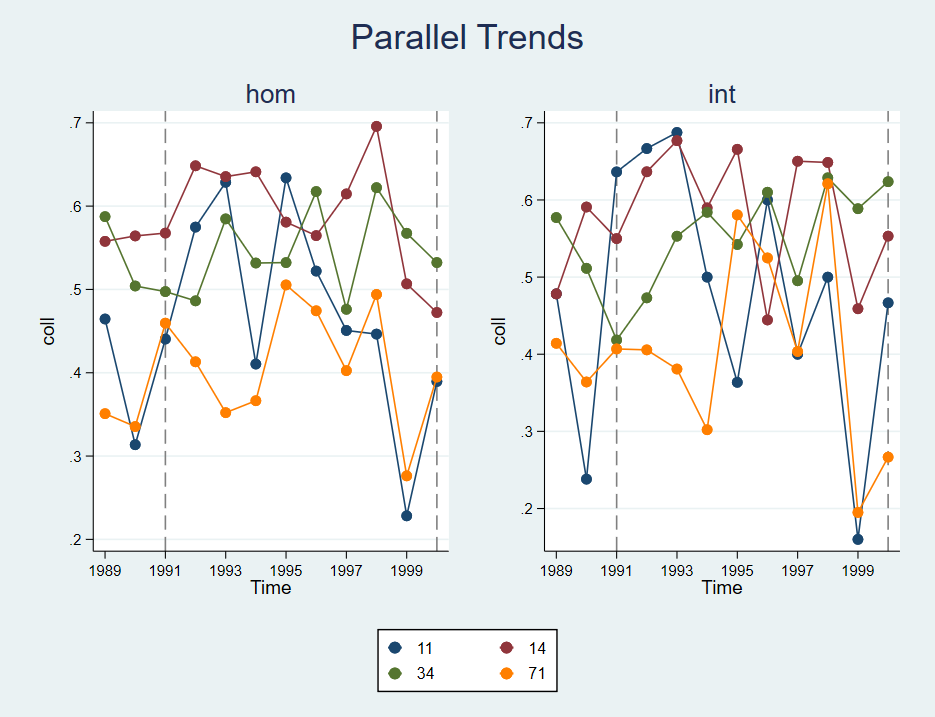

# didintjl
This Stata package acts as a wrapper for the Julia package DiDInt.jl. 

**didintjl** allows for unbiased estimation of the average effect of treatment on the treated (ATT) using a difference-in-differences framework that allows for covariates whose effects on the outcome of interest may vary by state and/or time, see https://arxiv.org/abs/2412.14447 for more details.

## Requirements
* **Julia**: Version 1.12.0 or later
* **Stata**: Version 16 or later
* **David Roodman’s Julia package for Stata**: [julia.ado](https://github.com/droodman/julia.ado) version 2.0.0 (January 18, 2026)
* **[DiDInt.jl](https://github.com/ebjamieson97/DiDInt.jl)**: Version 0.9.6 or later

### Suggested

* grc1leg2 (the legend for the parallel trends plots comes out a bit nicer if you have this Stata package)

## Installation 

```stata
net install didintjl, from("https://raw.githubusercontent.com/ebjamieson97/didintjl/main/")

* And to update: 
net install didintjl, replace from("https://raw.githubusercontent.com/ebjamieson97/didintjl/main/")
```

You can download and update the [DiDInt.jl](https://github.com/ebjamieson97/DiDInt.jl) package directly from Stata by running the following.

```stata
jl AddPkg DiDInt
```

## Get Help
More details can be found in the Stata help file.
```stata
help didintjl
```

## Return Values

```stata
r(att) // for the aggregate att
r(se) // for the standard error of the aggregate att
r(p) // for the p-value from the two-sided t-test of the aggregate att
r(jkse) // for the jackknife standard error of the aggregate att
r(jkp) // for the p-value from the two-sided t-test of the aggregate att using the jackknife standard error
r(rip) // for the p-value resulting from the randomization inference procedure
r(nperm) // see the number of random permutations that were done for randomization inference
matrix list r(didint) // for the results table at the sub-aggregate ATT level
```

## Example

### `didintjl`

- **Example do-file:** [`didintjl_example.do`](./didintjl_example.do)
- **Example dataset:** [`MeritExampleDataDiDIntjl.dta`](./MeritExampleDataDiDIntjl.dta)

```stata
. use "MeritExampleDataDiDIntjl.dta", clear
. didintjl, outcome("coll") state("state") time("year") ///
 treated_states("34 57 58 59 61 64 71 72 85 88") ///
 treatment_times("2000 1998 1993 1997 1999 1996 1991 1998 1997 2000") ///
 date_format("yyyy") covariates("asian male black") ccc("int") agg("cohort") seed(1234) weighting("both")


-----------------------------------------------------------------------------------------------------
                                DiDInt.jl Sub-Aggregate Results                                      
-----------------------------------------------------------------------------------------------------
Cohort                    | ATT             | SE     | p-val  | JKNIFE SE  | JKNIFE p-val | RI p-val
--------------------------|-----------------|--------|--------|------------|--------------|---------|
1991-01-01                |0.0044675        | 0.040  | 0.912  | .          | .            |0.940    |
--------------------------|-----------------|--------|--------|------------|--------------|---------|
1993-01-01                |0.0414129        | 0.039  | 0.285  | .          | .            |0.721    |
--------------------------|-----------------|--------|--------|------------|--------------|---------|
1996-01-01                |0.0637732        | 0.047  | 0.174  | .          | .            |0.458    |
--------------------------|-----------------|--------|--------|------------|--------------|---------|
1997-01-01                |0.0883183        | 0.034  | 0.011  | 0.106      | 0.407        |0.330    |
--------------------------|-----------------|--------|--------|------------|--------------|---------|
1998-01-01                |0.0301035        | 0.057  | 0.596  | 0.200      | 0.881        |0.691    |
--------------------------|-----------------|--------|--------|------------|--------------|---------|
1999-01-01                |0.1940669        | 0.023  | 0.000  | .          | .            |0.269    |
--------------------------|-----------------|--------|--------|------------|--------------|---------|
2000-01-01                |-0.0161931       | 0.035  | 0.646  | 0.095      | 0.865        |0.894    |
--------------------------|-----------------|--------|--------|------------|--------------|---------|

Aggregation Method: Cohort
Model Specification: Two-way DID-INT
Weighting: both

---------------------------------
   DiDInt.jl: Aggregate Results   
---------------------------------
Aggregate ATT: .05110589
Standard error: .01827509
p-value: .03130896
Jackknife SE: .0289968
Jackknife p-value: .08410244
RI p-value: .2112112
Random permutations: 999

. di r(att)
.05110589


. matrix list r(didint)

r(didint)[7,7]
                    ATT           SE         pval    JKNIFE_SE  JKNIFE_pval      RI_pval            W
1991-01-01    .00446749    .04023163     .9116345            .            .    .93993992    .20179564
1993-01-01    .04141289    .03867833    .28507739            .            .    .72072071    .19153485
1996-01-01    .06377317    .04672608    .17378093            .            .    .45845845    .07567336
1997-01-01    .08831835    .03427892    .01083141     .1056122    .40699229    .33033034    .32107738
1998-01-01    .03010352    .05668405    .59629387    .19966762     .8807652     .6906907    .10859342
1999-01-01    .19406688    .02271299    5.804e-13            .            .    .26926926    .03548525
2000-01-01   -.01619311    .03503226    .64635706      .094915    .86522174     .8938939     .0658401


* It is also possible to generate a gvar column and use syntax similar to csdid:
* (note that the variable merit is 1 for treated obs and 0 for non-treated obs)
. gen year_numeric = real(year) 
. bysort state (year_numeric): egen gvar = min(cond(merit == 1, year_numeric, .))
. replace gvar = 0 if missing(gvar) // This line is actually optional, you can leave non-treated states as having a missing gvar value

. didintjl, outcome(coll) state(state) time(year_numeric) gvar(gvar) covariates(asian male black) seed(1234)

-----------------------------------------------------------------------------------------------------
                                DiDInt.jl Sub-Aggregate Results                                      
-----------------------------------------------------------------------------------------------------
Cohort                    | ATT             | SE     | p-val  | JKNIFE SE  | JKNIFE p-val | RI p-val
--------------------------|-----------------|--------|--------|------------|--------------|---------|
1991-01-01                |0.0044675        | 0.040  | 0.912  | .          | .            |0.940    |
--------------------------|-----------------|--------|--------|------------|--------------|---------|
1993-01-01                |0.0414129        | 0.039  | 0.285  | .          | .            |0.721    |
--------------------------|-----------------|--------|--------|------------|--------------|---------|
1996-01-01                |0.0637732        | 0.047  | 0.174  | .          | .            |0.458    |
--------------------------|-----------------|--------|--------|------------|--------------|---------|
1997-01-01                |0.0883183        | 0.034  | 0.011  | 0.106      | 0.407        |0.330    |
--------------------------|-----------------|--------|--------|------------|--------------|---------|
1998-01-01                |0.0301035        | 0.057  | 0.596  | 0.200      | 0.881        |0.691    |
--------------------------|-----------------|--------|--------|------------|--------------|---------|
1999-01-01                |0.1940669        | 0.023  | 0.000  | .          | .            |0.269    |
--------------------------|-----------------|--------|--------|------------|--------------|---------|
2000-01-01                |-0.0161931       | 0.035  | 0.646  | 0.095      | 0.865        |0.894    |
--------------------------|-----------------|--------|--------|------------|--------------|---------|

Aggregation Method: Cohort
Model Specification: Two-way DID-INT
Weighting: both

---------------------------------
   DiDInt.jl: Aggregate Results   
---------------------------------
Aggregate ATT: .05110589
Standard error: .01827509
p-value: .03130896
Jackknife SE: .0289968
Jackknife p-value: .08410244
RI p-value: .2112112
Random permutations: 999


```

### `didintjl_plot`

- **Example do-file:** [`didintjl_plot_example.do`](./didintjl_plot_example.do)
- **Example dataset:** [`MeritExampleDataDiDIntjl.dta`](./MeritExampleDataDiDIntjl.dta)

```stata
use "MeritExampleDataDiDIntjl.dta", clear
* Here I am just using a subset of the data for purposes of demonstration
* looking at trends for every state in data is a bit cluttered
keep if inlist(state, "34", "71", "11", "14")
didintjl_plot, outcome("coll") state("state") time("year") treatment_times("2000 1991") date_format("yyyy") covariates("asian male black") ccc("hom int")
```




```stata
use "MeritExampleDataDiDIntjl.dta", clear

* didintjl and didintjl_plot also work with gvar arg
gen year_numeric = real(year) 
bysort state (year_numeric): egen gvar = min(cond(merit == 1, year_numeric, .))

* Specify the event(1) arg to get event plots!
didintjl_plot, outcome(coll) state(state) time(year_numeric) gvar(gvar) date_format("yyyy") covariates("asian male black") event(1) 
```

